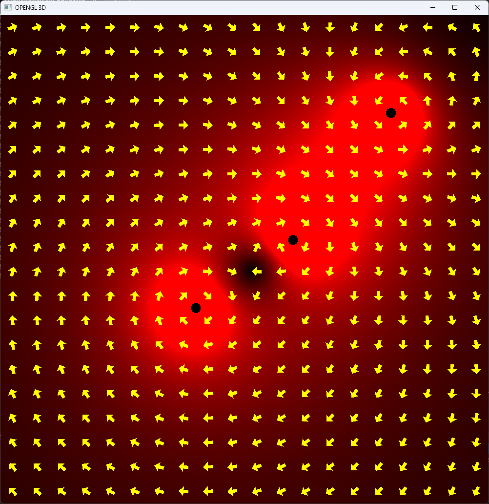

# MaxWell-GL
## L'Idée
Au début de la session nous avions le goût de construire nous même un projet incorporant des composantes graphiques et des notions scientifiques. C'est de cette manière que nous avons eu l'idée de simuler le champ magnétique de composantes électroniques. Notre objectif était de créer une application interactive en 3 dimensions avec le moins de dépendances possible qui permettraient à des étudians et à des professeur d'explorer les propriétés pratiquement magiques de l'électromagnétisme. Rapidement, nous avons bati un prototype avec trois fils parallèles. Les flèches indiquent la direction du champ alors que l'intensité du rouge est liée à l'intensité du champ magnétisme.

## Le projet
### Visual Studio
MaxWell-GL a été dévoloppé et bati en tant que solution Visual Studio 2019.

### C++
Nous avions à coeur d'écrire le projet en C++. Ce language nous donne la liberté de créer les structures et les paradignes de programation qui s'appliquent le plus à notre projet tout en gardant des qualité de vie et la possibilité d'utiliser certaines caractéristiques de la programation orienté objet enforcée par des languages comme Java. Toutefois, la structure adoptée durant le projet limite très fortement la programation orientée objet. Il est plus désirable de rassembler les données d'un objet dans une structure dépourvue de méthodes attributs. Les méthodes et les structures sont rassemblées statiquement dans la structure. Les données sont passées au fonctions. 

### OpenGL
Nous avons utilisé l'API [OpenGL](https://www.khronos.org/opengl/) comme outils pour interfacer avec l'écran, mais aussi comme outil nous permettant de pleinement utiliser la carte graphique et de drastiquement accélérer les calculs devant être fait. Par nature, la carte graphique est composé de centaines voir de millier d'unités de calculs capable de paralléliser des calculs matématiques. 

Contrairement à la programation fait sur un processeur central (CPU), la programmation sur une carte graphique (GPU) est bien différente. Les programmes ne sont pas éxécutés de manière linéaire, mais le plus possible en parallèle. Aussi, les ressources et les données de la carte graphique ne peuvent être invoqués au milieu d'un programme comme on peux le faire sur le processeur. On doit, depuis de le processeur, lier certains états ou plus simplement, ordonner un chemin que va suivre l'éxécution du code, et lier les données qui seront utilisés par des shaders. Ainsi, il faut présenter les dfférents shaders en plus des données qui seront utlisés avant l'éxécution. Une fois l'éxécution terminés, les données sont retournés à l'endroit spécifier où le programme peut les récupérer. Cette architecture s'apparante à celle d'un pipeline.

[source](https://vulkan-tutorial.com/images/vulkan_simplified_pipeline.svg)

#### GLEW
Puisque OpenGL n'est qu'une spécification garantie par les concepteurs et vendeurs, ils ne sont oubligés que de fournir les ressources attendues selon les fonctions spécifiées dans les guides. Or, la carte graphique n'est pas directement liée au processeur central. Elle est plutôt liée par une interface PCIe qui nécessite des appels au syystème d'opération que cela soit Windows, Linux ou MacOS. Ainsi, les  appels de fonctions peuvent varier selon la plateforme. De ce fait, des librairies sont nécessaire pour à la fois redéfinir les appels de fonctions au système pour le language de programation et pour qu'ils soient facilement compréhensible pour l'utilisation. C'est pour cela que nous avons décidés d'utiliser l'interface [GLEW](https://glew.sourceforge.net/) dans notre projet.

#### GLFW
Encore, l'utilisation d'API d'aussi pas niveau que OpenGL par rapport à des moteurs graphique comme Unity ou Unreal Engine implique qu'il est du devoir de l'utilisateur de créer son environnement graphique ce qui inclus la fênetre et tous les appels systèmes qui sont nécessaire pour enregistrer les entrées de la souris ou du clavier de l'utilisateur, par exemple. Ainsi, nous avons choisi d'utiliser [GLFW](https://www.glfw.org/), une librairie libre de droits pour gérer ces composantes du projet qui nous auraient pris beaucoup de temps et qui nous auraient empêché d'accomplir nos objectifs.

#### GLM
Enfin, nous avons eu besoin d'une dernière libraire: [GLM](https://github.com/g-truc/glm). C'est une librairie en C++, basée sur les templates ou generics dans d'autres languages et la surcharge d'opérateur, qui contient énormément de définitions de types mathématiques que cela soit de vecteurs ou matrices ainsi que des fonctions connexes qui facilitent grandement la programation dans un environnement 3D, mais qui présente aussi les données dans un format qui est directement compatibles avec les API graphiques comme OpenGL que nous utilisons.

### L'application

### Les équations
À ce stade du projet, seule l'équation de Biot-Savard a été utilisé pour calculer le champ magnétique autour d'un fil ou d'un solénoïde.

$$ \vec{B} = {\mu_0 i \over 4\pi} \int {{{\mathrm d \vec{l}} \times \vec{u}} \over r^2} $$

Dans le cas d'un fil droit présumablement infini, le champ est toujours perpendiculaire à la direction du fil et il est possible de simplifier l'équation en enlevant l'intégrale. Il est donc possible de seulement calculer le champ à partir du vecteur orthogonal reliant le point de mesure et le fil. L'équation est refaite pour tous les fils présents dans la simulation.

$$ \vec{B} = { \mu_0 i \over 2 \pi r }  ( \vec{u_l} \times \vec{u_{r\perp}} ) $$

Dans le cas d'un solénoïde dont la longueur, le nombre de tours et le rayon sont arbitraires, nous avons décidés d'approximer l'intégrale en intégrant le champ d'après $\theta$. Ainsi nous obtenons l'intégrale définie qui peut être approximée comme ci-dessous. Le champ est calculé pour chacun des voxels de l'espace vectoriel.

$$ \vec{B} = {\mu_0 i \over 2 \pi} \int\limits_0^{2 \pi L \over N} {{{\mathrm d \vec{\theta}} \times \vec{u}} \over r^2} $$

### Les calculs physiques

[source](https://learnopengl.com/img/guest/2022/compute_shader/local_space.png)

##### Voici une démonstration de l'éxécutable à ce moment:

## Les difficultés
Bien que nous avions de l'expérience avec les outils que nous avons utilisés, nous avons tout de même fait face à des difficultés. La majorité étaient en lien direct avec OpenGL. Des outils de déboguage sont disponible. [RenderDoc](https://renderdoc.org/) est libre de droits et nous l'avons utilisé. 

|       |       |
| :---: | :---: |
|  |  |

Il est donc du devoir du progammeur d'avoir une compréhension assez appronfie de son programme et de la  manière avec laquelle fonctionne OpenGL. 

## L'échéancier
Bien que nous n'ayons pas pu paufiner le projet comme nous le voulions, nous avons tout de même atteints la majorité de nos objectifs. Certaines parties de l'échéancier ont pris un peu de retard en cours de chemin: principalement l'interface fonctionnelle, mais incomplète et la simulation. Toutefois, les simulations des solénoïdes et des fils sont présentes et fonctionnelles dans le projet, il est seulement arrivé que nous n'avons pas eu la détermination d'ajuster la fonction qui crée le solénoïde pour qu'elle crée un fil à la place. Ainsi, sans modèle et interface pour facilement aller d'un à l'autre, nous avons inclus qu'un solénoïde.

## La structure UML
Pour ce projet, nous n'avons pas formellement utilisé de programmation orientée objet. Cela implique que nous n'avons pas utilisé de polyformisme ni d'héritage. Les données sont plutôt assemblés en structures dans lesquelles sont aussi définies des fonctions statiques. Ces fonctions statiques prennent en paramètre la structure dont elles font partie. Ces définitions peuvent s'apparenter à des namespaces. Le graphique ci-dessous, fait par l'outil de documentation [Doxygen](https://www.doxygen.nl/) indique les liens de dépendance entre nos structures.

## Les perspectives
Le projet, bien qu'à un stade fonctionnel, est encore loin d'être fini. Nous aurions aimé avoir été capable d'intégrer plus de fonctionnalités dans l'application. Il aurait été intéressant de d'avoir plus de composantes électroniques comme des fils, des toroïdes, etc. Il aurait aussi été plaisant d'intégrer des simulations dans le temps où le champ magnétique pourait varier selon un programme défini. L'utlisateur aurait ainsi pu étudier en plus grande profondeur les mécaniques du courant alternatif. Avant tout, il faudrait aussi revoir l'interface utilisateur pour réduire le plus possible tout information écrite statiquement danns le code et permettre à l'utilisateur de contrôler le plus possible son environnement. Il devrait être capable d'ajouter ou de retirer des composantes, de modifier la position et l'orientation de celles-ci, de modifier leurs propriétés électriques ou graphiques, etc.

[source](https://i5.walmartimages.com/asr/673fcd95-2bfd-405d-88f6-0744d2af719e.6d74a8f705166fa7dfd0bf0512c75b7a.jpeg?odnHeight=612&odnWidth=612&odnBg=FFFFFF)

## La conclusion
En conclusion, notre planification était plus ambitieuse que ce que l'on a pu réaliser. Nous avons tout de même atteins certains buts. Nous avons une application OpenGL fonctionnelle qui permet tout de même d'en apprendre plus sur l'électromagnétisme.

## Crédit
Le projet a été codéveloppé dans le cours d'intégration en sciences informatiques et mathématiques au Collège Bois-de-Boulogne par Charles-Antoineet Alexandre Lafrenière.

## Licence
Le projet est libre de droits sous la licence GNU. Voir [GPL-3.0 licence.txt](https://github.com/pastaButter1/MaxWell-GL?tab=GPL-3.0-1-ov-file#) pour plus d'information.
